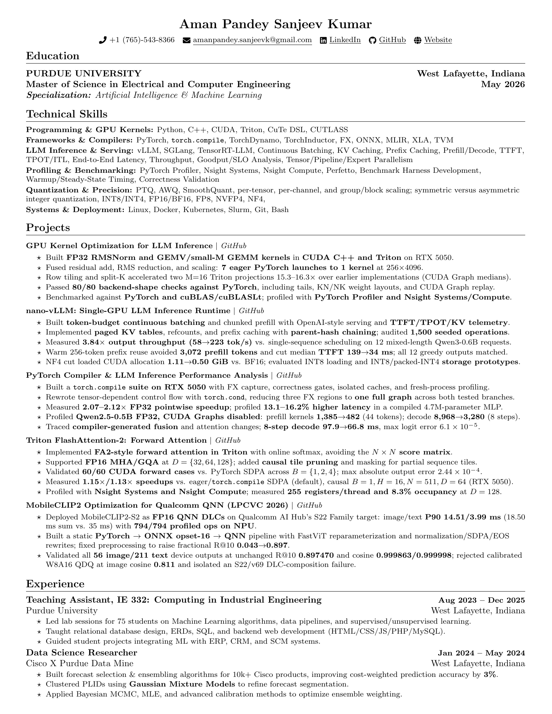

<div class="resume-toolbar">
<span class="resume-kicker">LLM Inference &amp; GPU Performance</span>
<div class="resume-actions resume-actions-panel"><a class="resume-primary-action" href="Resume.pdf?v=2026-10-08" download="Aman_Pandey_Sanjeev_Kumar_Resume.pdf"><i class="bi bi-download" aria-hidden="true"></i> Download Resume</a><a href="Resume.pdf?v=2026-10-08" target="_blank" rel="noopener">Open PDF</a><a href="projects/index.html">View Projects</a><a href="https://github.com/AmanPandey28" target="_blank" rel="noopener">GitHub</a><a href="https://www.linkedin.com/in/aman-pandey-sanjeev-kumar-b55867b8/" target="_blank" rel="noopener">LinkedIn</a></div>
</div>

```{=html}
<!-- Keep essential sizing inline so cached site styles cannot crop the resume. -->
<div class="resume-viewer resume-viewer-primary resume-viewer-preview" style="box-sizing: border-box; width: 100%; max-width: 100%; height: auto; min-height: 0; overflow: hidden; border: 1px solid var(--resume-frame-border, #d6d6d6); border-radius: 8px;">

</div>
```

## Technical Focus

<div class="project-stack">
  <a class="project-row-card" href="https://github.com/AmanPandey28/cross_dsl_kernels" target="_blank" rel="noopener">
    <span class="project-row-title">GPU Kernel Engineering</span>
    <span class="project-row-meta">FP32 RMSNorm and GEMV/small-M GEMM in CUDA C++ and Triton; fused seven eager launches into one and passed 80/80 backend-shape checks against PyTorch</span>
  </a>

  <a class="project-row-card" href="https://github.com/AmanPandey28/nano_vllm_pp" target="_blank" rel="noopener">
    <span class="project-row-title">Single-GPU LLM Runtime</span>
    <span class="project-row-meta">Continuous batching, chunked prefill, paged KV tables, and prefix caching; 58 → 223 tokens/s versus single-sequence scheduling on 12 mixed-length Qwen3-0.6B requests</span>
  </a>

  <a class="project-row-card" href="https://github.com/AmanPandey28/torch-compile-internals" target="_blank" rel="noopener">
    <span class="project-row-title">Compiler Performance Analysis</span>
    <span class="project-row-meta">FX capture, torch.cond, isolated caches, and fresh-process profiling; Qwen2.5-0.5B FP32 eight-step decode 97.9 → 66.8 ms with CUDA Graphs disabled</span>
  </a>

  <a class="project-row-card" href="https://github.com/AmanPandey28/triton-flash-attention" target="_blank" rel="noopener">
    <span class="project-row-title">Triton Forward Attention</span>
    <span class="project-row-meta">FA2-style online softmax, FP16 MHA/GQA, causal tile pruning, and partial-tile masking; 60/60 CUDA forward cases validated against PyTorch SDPA</span>
  </a>

  <a class="project-row-card" href="https://github.com/AmanPandey28/lpcv2026" target="_blank" rel="noopener">
    <span class="project-row-title">Edge AI Deployment</span>
    <span class="project-row-meta">MobileCLIP2-S2 via PyTorch → ONNX → Qualcomm QNN; image/text P90 14.51/3.99 ms on S22 Family, with 794/794 profiled operations on NPU</span>
  </a>
</div>

## Technical Skills

- **Programming &amp; GPU kernels:** Python, C++, CUDA, Triton, CuTe DSL, CUTLASS.
- **Frameworks &amp; compilers:** PyTorch, torch.compile, TorchDynamo, TorchInductor, FX, ONNX, MLIR, XLA, TVM.
- **LLM inference &amp; serving:** vLLM, SGLang, TensorRT-LLM, continuous batching, KV and prefix caching, prefill/decode scheduling, TTFT, TPOT/ITL, throughput, goodput/SLO analysis, and tensor/pipeline/expert parallelism.
- **Profiling &amp; benchmarking:** PyTorch Profiler, Nsight Systems, Nsight Compute, Perfetto, benchmark harnesses, warmup/steady-state timing, and correctness validation.
- **Quantization &amp; precision:** PTQ, AWQ, SmoothQuant, scaling granularity, symmetric/asymmetric integer quantization, INT8/INT4, FP16/BF16, FP8, NVFP4, NF4.
- **Systems &amp; deployment:** Linux, Docker, Kubernetes, Slurm, Git, Bash.

## Education

**Purdue University** · West Lafayette, Indiana

Master of Science in Electrical and Computer Engineering · May 2026

Specialization: Artificial Intelligence &amp; Machine Learning

## Experience

**Teaching Assistant, IE 332: Computing in Industrial Engineering**

Purdue University · August 2023 to December 2025

- Led labs for 75 students on machine learning algorithms, data pipelines, and supervised/unsupervised learning.
- Taught relational database design, ERDs, SQL, and backend web development with HTML/CSS/JS/PHP/MySQL.
- Guided student projects integrating ML with ERP, CRM, and SCM systems.

**Data Science Researcher**

Cisco × Purdue Data Mine · January to May 2024

- Built forecast selection and ensembling algorithms for 10,000+ Cisco products, improving cost-weighted prediction accuracy by 3%.
- Clustered PLIDs with Gaussian Mixture Models to refine forecast segmentation.
- Applied Bayesian MCMC, MLE, and calibration methods to optimize ensemble weighting.
